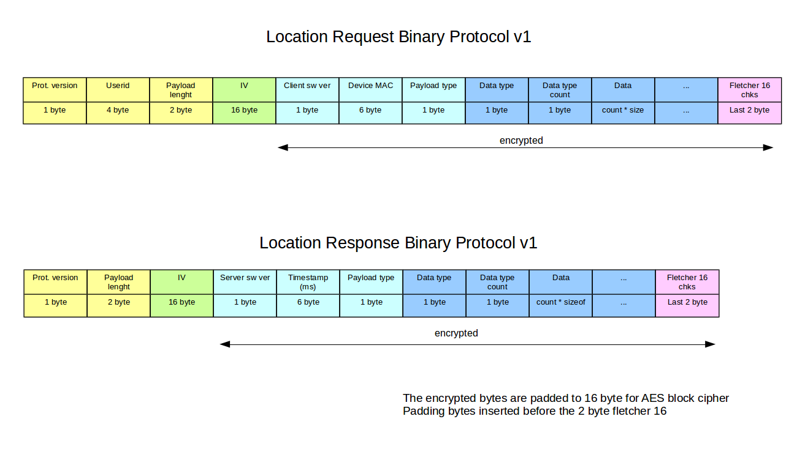
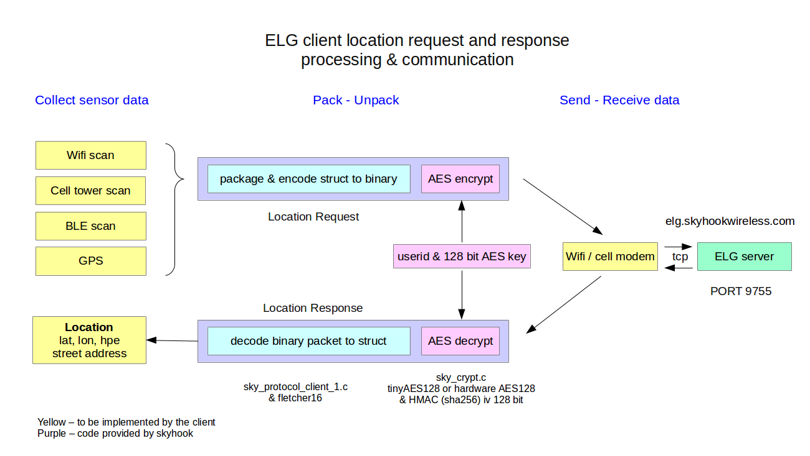

# Embedded Location Gateway -- Client Library

### Overview

The provided client library is used for encoding/decoding and encrypting/decrypting data for the Embedded Location Gateway server. 
The client sends binary encoded and encrypted Wi-Fi Access Points, CELL, and GPS location requests through a tcp connection to ELG server. Location responses are returned from the server based on the specified location beacon data - decrypted, decoded, and reconstructed.

Currently there are two different types of supported location requests:
- location request -- latitude, longitude, hpe
- location request with full address lookup -- in addition to location request address is also provided based on curated, open-source data as a free feature of the service.

### Binary Protocol

### ELG client request and response processing

### Steps 
1. Scan wifi networks
Use your wifi chip to scan the wireless access points.

2. Populate the location request struct with the provided AES key, userid and the scanned Wi-Fi access points. Additional cell and GPS data may included in the location request. 

3. Encode access points and other sensor data to binary by the Skyhook provided SDK protocol code

4. Encrypt encoded data with the provided encryption library or, when available, with hardware encryption. The initialization vector for encryption is generated by the sky_crypt library.

4. Send encrypted packet to Skyhook ELG server over TCP

5. Receive response from ELG server.

6. Decrypt received packet.

7. Decode packet into Location Response struct.

### Included Libraries and Source Code

The library consist of the following open source libraries

- tiny_AES128-C
AES 128 encryption library used for encryption and decryption

- HMAC 
Used for generating random values with SHA256 as part of encryption

- elg_lib
Skyhook ELG client library

## Skyhook provided source code - elg_lib

- skyhook_elg_client_demo.c  
This program demonstrates the necessary steps to generate a location requests and receive a response.
From this code, substitute the userid and AES key received from your Skyhook Account Management contact and compile.

- sky_types.h  
Contains all the data structures, enumerations, key definition, and error codes referenced  elsewhere in the source.

- mauth.c  
Generates random numbers for the 16 byte initialization vector using HMAC and is used during encryption.

- sky_protocol_client_1.c  
Protocol v1 location request encoding and location response decoding.
This converts the location request struct to a binary representation and leverages sky_crypt for encryption.
This also handles location response decoding authenticates data and returns location response struct or errors.

- sky_crypt.c  
Used by the client code, as stated, to encrypt and decrypt the data buffer. Data has to be divisible by 16 for the AES block cypher.
fletcher16 generates a 16 bit checksum

- skyhook_util.c  
This utility prints formatted data buffer, IP address and location response to be human readable and is also used for hostname lookup.

### Demo application build

Requirements
- make
- gcc

Include/Replace UserID and Key provided by your Skyhook Account Rep

Build  
make -- in root dir

Run  
./bin/skyhook_client_demo

